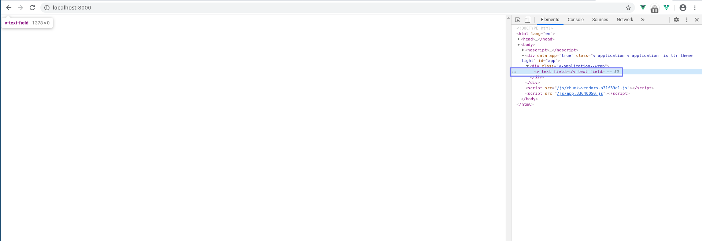

# vuetify-v-text-field-not-showing-on-prod

## Project setup
```
yarn install
```

Project only contains the following template:
```vue
<template>
  <v-app>
    <component :is="'v-text-field'"></component>
    <!-- <v-text-field></v-text-field> -->
  </v-app>
</template>
```

We expect a `v-text-field` to be rendered, however, nothing visible is rendered.
Only an empty `v-text-field` tag can be seen.



If you replace `'v-text-field'` by `'input'`, then an input is rendered and
visible, as expected.

### Compiles and hot-reloads for development
```
yarn run serve
```

### Compiles and minifies for production
```
yarn run build
```
